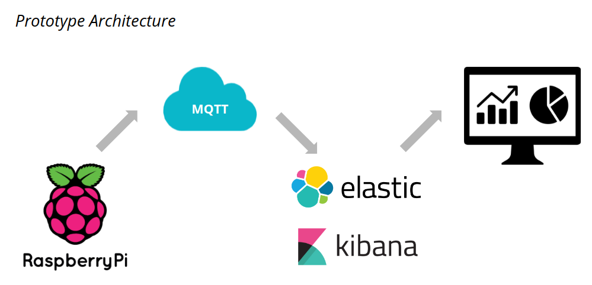

# SummerSchoolPrototype

code used for the prototype

## Architecture

### Populating the DB
The [mqttToELasticSeach.py](mqttToELasticSeach.py) its is implemented a simple mqtt client that saves any message
posted on the `/home/vibration` topic and store it in the elasticsearch index called `customer`

### Visualization
We used a vary basic bar plot using Kibana for the visualization of the data. The bar plot just counts the vibration events
with a time-based histogram.